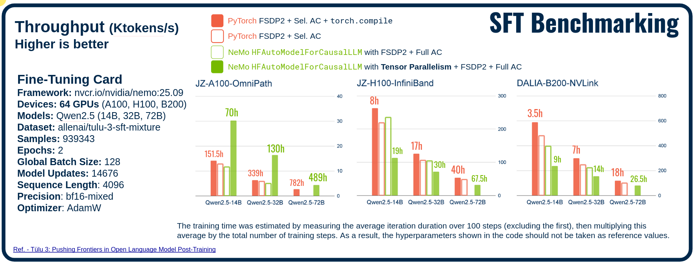
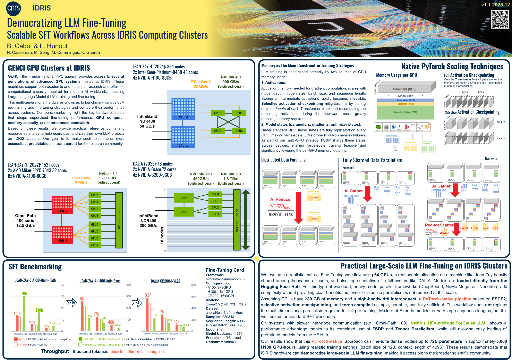

# Democratizing-LLM-FT  
### Scalable SFT Workflows Across IDRIS Computing Clusters
---

## 🚀 Practical Large-Scale LLM Fine-Tuning on IDRIS Clusters

We study a realistic Instruct Fine-Tuning (SFT) workflow on **64 GPUs**, corresponding to the full **DALIA** system and a resource scale still achievable on the **Jean Zay** partitions. Models are loaded directly from the **Hugging Face Hub**, reflecting common academic and industrial practices.

At this scale, heavyweight frameworks such as *NeMo-Megatron*, *DeepSpeed*, *Nanotron*, or *TorchTitan* introduce unnecessary complexity because they rely on model-parallel strategies that are not needed for **64-GPU training**. Instead, a **PyTorch-native pipeline**—using HF `transformers/datasets`, **FSDP2**, **selective activation checkpointing**, and **torch.compile**—offers the best combination of flexibility, efficiency, and portability, provided GPUs have **≥ 80 GB** of memory and are connected with a **high-bandwidth interconnect**.

We also evaluate NVIDIA's `HFAutoModelForCausalLLM`, which supports HF model loading but is now deprecated in favor of the newer **NeMo AutoModel**, itself still under development and limited to **NVIDIA-only environments**.

Based on our measurements, a **3,000 H100 GPU-hour allocation** is sufficient to fine-tune large dense models such as **Qwen2.5-72B** in this configuration.

Future work will extend this democratization to **Mixture-of-Experts training** (expert parallelism), **large-context models** (context parallelism), and more advanced stages such as **pre-training** and **post-training with RL**, while tracking progress in **TorchTitan** and **NeMo AutoModel**.

Our realistic Instruct Fine-Tuning scenario follows the setup described in [Tulu 3: Pushing Frontiers in Open Language Model Post-Training (2024)](https://arxiv.org/abs/2411.15124).

## ⚠️ Important Note on Scope and Fairness

In this specific scenario — **dense SFT on 64 GPUs**, using pretrained weights from the HF Hub and relying on moderate batch sizes — a **PyTorch-native workflow with Hugging Face Transformers** is the most practical and efficient solution for us. This does **not** place NVIDIA NeMo at a disadvantage intentionally: the framework is simply **not evaluated here in the conditions where it shines**. We fully acknowledge that **NeMo becomes indispensable for other use cases**, such as large-scale pre-training, advanced model-parallelism, Mixture-of-Experts architectures, or complex multi-node pipelines.

Similarly, **TorchTitan** is rapidly gaining relevance and deserves dedicated analysis in future work. Our focus on PyTorch+Transformers in this report reflects the narrow scope of this benchmark, not a general preference in all contexts.

---

## ✅ Conclusion

In a realistic SFT scenario using **small batches (~128 sequences)** on **64 GPUs**, with dense LLMs up to **72B parameters** and a **4096 context length**, and with pretrained weights loaded from the **Hugging Face Hub**, we find that the **FSDP2 + selective activation checkpointing + `torch.compile`** pipeline offers the **best balance of performance, clarity, flexibility, and portability**.

This conclusion holds **only if GPUs provide ≥ 80 GB of memory** and the system offers a **modern high-bandwidth interconnect**. Under these conditions, the workflow remains simple to configure and highly reproducible across heterogeneous HPC environments.  
**This conclusion applies to SFT workloads only—pre-training requires multi-dimensional parallelism (TP/PP/FSDP).**

In this context, introducing **tensor parallelism** increases operational complexity without providing gains, and adding **pipeline parallelism** makes model handling significantly more complex (architecture restructuring, multi-shard weight loading). In contrast, **FSDP/FSDP2 shards parameters transparently**, making large-scale SFT feel almost seamless. However, FSDP alone becomes insufficient at **very large GPU counts** required for full pre-training or extreme-scale models, where richer parallelism strategies become mandatory.

## 📊 Figure: SFT Benchmarking Across IDRIS GPU Clusters



The figure compares Supervised Fine-Tuning (SFT) throughput (in **Ktokens/s**) and total training time across three GPU partitions available at IDRIS:
- **JZ-A100-OmniPath**
- **JZ-H100-InfiniBand**
- **DALIA-B200-NVLink**

### Impact of Interconnect Performance
A strong dependency on the cluster interconnect is visible:
- Moving from **A100-OmniPath** to **H100-InfiniBand** yields a **×10 improvement** in throughput, mainly due to OmniPath becoming the limiting factor in distributed training.
- Going from **H100-InfiniBand** to **B200-NVLink** provides an additional **×2 speed-up**, thanks to full-node NVLink enabling much higher FSDP2 throughput.

### PyTorch FSDP2 + sAC + `torch.compile`
On **H100-InfiniBand** and **B200-NVLink**, our simple PyTorch pipeline (**FSDP2 + selective Activation Checkpointing + `torch.compile`**) delivers the best performance among all tested configurations.  
These results highlight that:
- selective AC reduces overhead compared to full AC  
- `torch.compile` contributes a significant boost across all model sizes  
- FSDP2 scales efficiently when the interconnect is not the bottleneck  

### NeMo HFAutoModelForCausalLLM (TP + FSDP2)

On the older **A100-OmniPath** partition, the best-performing configuration is the **Tensor Parallelism (TP) + FSDP2** setup from NeMo. In this scenario, a **2D parallelism strategy** is employed across the 64 GPUs:  
- **Tensor Parallelism** spans *all GPUs inside each node* (TP size = 4 or 8 depending on the hardware),  
- while **FSDP2** shards *across nodes*, with an effective FSDP group size of **16 or 8 GPUs**.

This hybrid layout is better suited to a **low-bandwidth interconnect** like OmniPath, since TP keeps most communication *intra-node* (high throughput), while FSDP only synchronizes across a smaller cross-node group. This makes the approach more efficient for very large models and helps compensate for the inter-node bottleneck where FSDP alone would be critical.

### Hollow Bars — Cross-Checking the Two Baseline Configurations

The **hollow bars** are included to validate the comparison between the two **solid-bar configurations**, which represent distinct training strategies. These hollow bars correspond to simplified or baseline versions of each approach and should therefore appear **nearly equivalent**:

- The **orange hollow bar** represents **PyTorch FSDP2 + selective AC (sAC) without `torch.compile`**.  
- The **green hollow bar** represents **NeMo HFAutoModelForCausalLLM with full FSDP2 (no TP) + Full Activation Checkpointing + Liger Kernels**.

The small difference between the two baselines is explained primarily by:
- the absence of **selective** activation checkpointing on the NeMo baseline (NeMo only enables **full AC**),  
- and the potential impact of **Liger Kernels** on memory layout and compute behavior.

**GPU Memory Usage Notes** : The NeMo baseline (green hollow bar) generally shows **higher GPU memory usage** than the PyTorch baseline (orange hollow bar).

Despite these discrepancies, the two hollow baselines are close enough to serve as useful reference points for interpreting the differences shown by the corresponding solid-bar configurations.

### Notes
**Training time estimation:** we measured the **average iteration duration over 100 steps** (excluding the first) and multiplied this value by the total number of training steps.  
**Important:** the hyperparameters shown in the code **must not be considered as reference**, because the **gradient descent was not tuned or monitored** — this was a **benchmark-only setup**, not an optimized training run.

## Containers vs. Modules — Practical Observations

For portability and reproducibility across heterogeneous systems, we chose to rely on an NGC container image (`nemo-25.09`) rather than `module` or virtual/conda environments. In practice, the container setup proved **significantly more performant** than the `module` environment for this heavily distributed workload, particularly due to more consistent CUDA/NCCL integration.

However, containers can also hide networking issues. We strongly recommend enabling NCCL diagnostics using  
`NCCL_DEBUG=WARN`, as we observed cases where the interconnect failed to detect its intended interfaces and silently fell back to a **degraded communication mode**. Monitoring these warnings is essential to ensure that distributed performance remains optimal.


## 🔁 Reproducing the Experiments

To reproduce our benchmarks, follow the steps below:

### 1. Adjust local paths
Modify the paths in the training scripts (`./*.py`) so that:
- model checkpoints,
- dataset locations,
- logging directories,
- and output folders  
match your local filesystem or shared cluster environment.

### 2. Configure your SLURM environment
If you are running on a SLURM-managed cluster, adapt the provided SLURM job files inside `slurm/`:
- account/project name  
- partition or QoS  
- number of nodes / GPUs per node  
- container or module settings  
- job duration and output folders  

### 3. Launch the experiments
Once the SLURM scripts are adjusted, you can run the experiments directly:

```bash
sbatch slurm/FSDP_sAC_h100_72B.slurm
sbatch slurm/DALIA_NeMo_FSDP_TP_32B.slurm

```

## Poster


----
# Code review

## Selective Activation Checkpointing (sAC)

Activation checkpointing is essential to reduce the memory footprint during LLM training.  
Instead of storing all intermediate activations during the forward pass, PyTorch replays part of the computation during the backward pass, keeping only what is strictly necessary.

In our implementation, **selective activation checkpointing (sAC)** allows applying checkpointing only on a *fraction* of the Transformer blocks, giving fine-grained control over the trade-off between:
- GPU memory usage  
- Runtime overhead   

The **runtime overhead introduced** by sAC depends directly on the selected ratio and typically ranges from 0% (no checkpointing) up to **~20%** under full activation checkpointing

## 🔧 Enabling Selective Activation Checkpointing

```python
### Selective Activation Checkpointing
if args.sac:
    model.config.use_cache = False
    BlockCls = type(model.model.layers[0])
    apply_fsdp_checkpointing(model, BlockCls, args.sac)
```


## Gradient Accumulation (Last-Resort Memory Relief)

When GPU memory becomes fully saturated — even with **full activation checkpointing** enabled — the only remaining option is to reduce the per-GPU batch size and compensate using **gradient accumulation**. This technique splits a large batch into several micro-batches processed sequentially, accumulating gradients before applying an optimizer step. While it effectively lowers memory usage, its drawback is a **runtime penalty that is almost linear** in this context: using `grad_acc=2` nearly doubles the iteration time, and so on. Gradient accumulation should therefore be considered a **last-resort solution** when all other memory-optimization strategies have been exhausted.

## Collate Function for Instruct Fine-Tuning

In Instruct Fine-Tuning with dialogue-style datasets, the `collate_function` must correctly prepare inputs and labels for causal language modeling. Tokens that belong to the *non-assistant role part* (e.g., user or system messages) must be assigned the label **`-100`**, which lies outside the vocabulary range and is therefore ignored by the Cross-Entropy loss. Only the padding tokens are masked as well, ensuring that the model learns exclusively from the assistant’s response tokens.

For benchmarking purposes, our pipeline pads (or truncates) **all sequences to a fixed `max_seq_length`**, ensuring a constant computational shape across training steps. In standard training practice, however, sequences are padded only up to the **maximum length within each batch** and truncated at `max_seq_length`, offering better memory and runtime efficiency.


## FSDP2 with Mixed Precision (BF16)

We rely on **PyTorch FSDP2** to shard model parameters and optimizer states across GPUs while using **mixed precision** to balance numerical stability and performance. In our setup, parameters are stored in `float32` in their sharded form, but exposed as `bfloat16` when unsharded for compute. This follows the design described in the [official PyTorch FSDP2 tutorial.](https://docs.pytorch.org/tutorials/intermediate/FSDP_tutorial.html)

Below is a minimal example of how we configure **FSDP2 in BF16-mixed mode**:

```python
fsdp_kwargs = {
    "mp_policy": MixedPrecisionPolicy(
        param_dtype=torch.bfloat16,
        reduce_dtype=torch.float32,
    )
}

for layer in model.layers:
    fully_shard(layer, **fsdp_kwargs)
fully_shard(model, **fsdp_kwargs)

# sharded parameters are float32
for param in model.parameters():
    assert param.dtype == torch.float32

# unsharded parameters are bfloat16
model.unshard()
for param in model.parameters(recurse=False):
    assert param.dtype == torch.bfloat16
model.reshard()
```

## Loading the Model from the Hugging Face Hub

Models are loaded from the **Hugging Face Hub** using the standard API:

```python
from transformers import AutoModelForCausalLM

model = AutoModelForCausalLM.from_pretrained(
    model_path,
    torch_dtype="bfloat16",
)
```

For large models in the tens of billions of parameters, memory pressure appears at two stages:

1. **On GPU**: a full BF16 or FP32 copy can easily exceed device memory if parameters are not sharded early.

2. **On CPU**: naïvely casting the whole model to float32 or loading directly in float32 causes the entire parameter set to reside in host RAM at once, which frequently leads to CPU OOM.

The `.from_pretrained` method is **relatively CPU-memory efficient** when loading the model in its **original precision** (often BF16), because it streams weights without duplicating them unnecessarily. However, FSDP2 mixed precision expects parameters to be managed internally in **float32** (with compute typically in BF16), which creates a tension:

* **Casting on CPU** → large, temporary FP32 copy in host RAM → high risk of OOM
* **Casting on GPU** → large FP32 footprint before sharding → high risk of OOM as well

To resolve this, we cast to FP32 while sharding, layer by layer:

```python
for layer in model.model.layers:
    fully_shard(layer.type(torch.float32), **fsdp_kwargs)
fully_shard(model.type(torch.float32), **fsdp_kwargs)
```
This pattern preserves **CPU and GPU memory** by avoiding a global FP32 copy of the model in RAM. The trade-off is a **non-negligible casting time overhead** (on the order of 100 to 1000 seconds, depending on model size and hardware), but it keeps the loading process feasible for very large models without hitting CPU or GPU out-of-memory errors.


## FSDP2 Model Checkpointing — Saving & Loading with Distributed Checkpoint (DCP)

PyTorch FSDP2 introduces a new, robust mechanism for saving and loading model weights using the **Distributed Checkpoint (DCP)** APIs.  
These APIs allow exporting a **full, consolidated state dict** from a sharded FSDP2 model, while minimizing CPU memory usage thanks to options such as `cpu_offload=True` and `mmap=True`.

---

### Saving a Full FSDP2 State Dict

With `get_model_state_dict`, PyTorch reassembles the full model state from all shards.  
The `cpu_offload=True` option ensures that reconstruction happens safely even for large models.

```python
from torch.distributed.checkpoint.state_dict import get_model_state_dict, StateDictOptions

model_state_dict = get_model_state_dict(
    model=model,
    options=StateDictOptions(
        full_state_dict=True,   # consolidate all shards into a single full state dict
        cpu_offload=True,       # avoids holding the full model in GPU memory
    )
)

torch.save(model_state_dict, "model_state_dict.pt")
```
This produces a **single-file checkpoint** compatible with standard `torch.load`, HF tooling, and any downstream environment.

### Loading a Full FSDP2 State Dict

To reload a saved model, we use `set_model_state_dict`.
The `mmap=True` option helps limit CPU memory usage by memory-mapping the checkpoint file instead of loading it entirely into RAM.

```python
from torch.distributed.checkpoint.state_dict import set_model_state_dict, StateDictOptions

# mmap=True reduces CPU memory pressure for large models
full_sd = torch.load(
    "checkpoints/model_state_dict.pt",
    mmap=True,
    weights_only=True,
    map_location='cpu',
)

set_model_state_dict(
    model=model,
    model_state_dict=full_sd,
    options=StateDictOptions(
        full_state_dict=True,        # indicates that this is a consolidated checkpoint
        broadcast_from_rank0=True,   # rank 0 loads, other ranks receive via broadcast
    ),
)
```
This properly rehydrates the sharded model across all devices.

### Optimization Tip: Avoid Recasting & Re-Sharding on Every Run

As described earlier, casting the model to **FP32** and **sharding it layer-by-layer** with FSDP2 can take 100–1000 seconds, especially for 30B–70B models.
To avoid paying this cost for every fine-tuning run, you can:
1. Load the pretrained model from the HF Hub in BF16
2. Cast + shard layer-by-layer with FSDP2 (memory-safe approach)
3. **Save this already-prepared model using DCP (the section above)**
4. Reload it instantly for future experiments

This workflow reduces startup time from **minutes** to **seconds**, avoids repeated casting overhead, and ensures you always start from the exact pretrained weights.

###  FSDP2 Optimizer Checkpointing — Saving & Loading with Distributed Checkpoint (DCP)
In FSDP2, **optimizer states are sharded across GPUs**, just like model parameters.  
The Distributed Checkpoint (DCP) APIs make it possible to save and reload these sharded optimizer states efficiently, without requiring full consolidation on a single machine.
Refer to [pytorch/examples](https://github.com/pytorch/examples/blob/main/distributed/FSDP2/checkpoint.py) for loading and saving optimizer state dicts with `set_optimizer_state_dict` and `get_optimizer_state_dict`.

## 📎 Attribution

This work is openly available to the community.  
If you reuse our scripts, methodology, or benchmark results, please cite or acknowledge this project.  
It supports open, transparent, and reproducible LLM research on HPC infrastructures.


